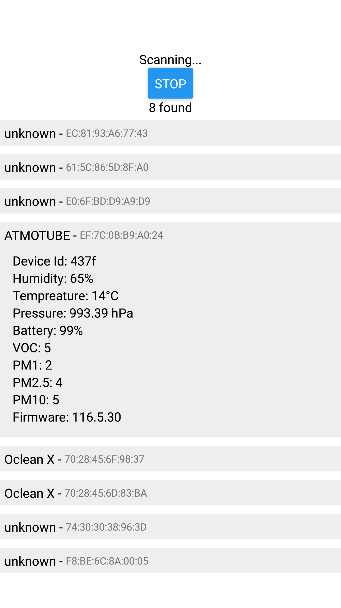

# expo-ble-test
React Native Expo Bluetooth Low Energy test app

This app will continuously scan BLE advertising beacons and display more detailed info from any Atmotube devices it can see.

Everything interesting is in `App.tsx`.

Based off the protocol listed here: https://support.atmotube.com/en/articles/10364981-bluetooth-api

https://www.youtube.com/shorts/90BKWQciJjQ

In this video you can see it displaying stats from the Atmotube. And how humidity and VOCs go up when I blow on the sensor.

We could also do something with connecting to the device, moniting GATT characteristics and sending commands, but it's already too much for one day ;)

PS: I see the mispellng, but it's too late to make new screenshots and video...